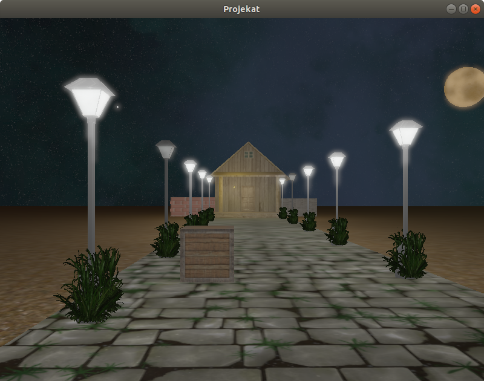
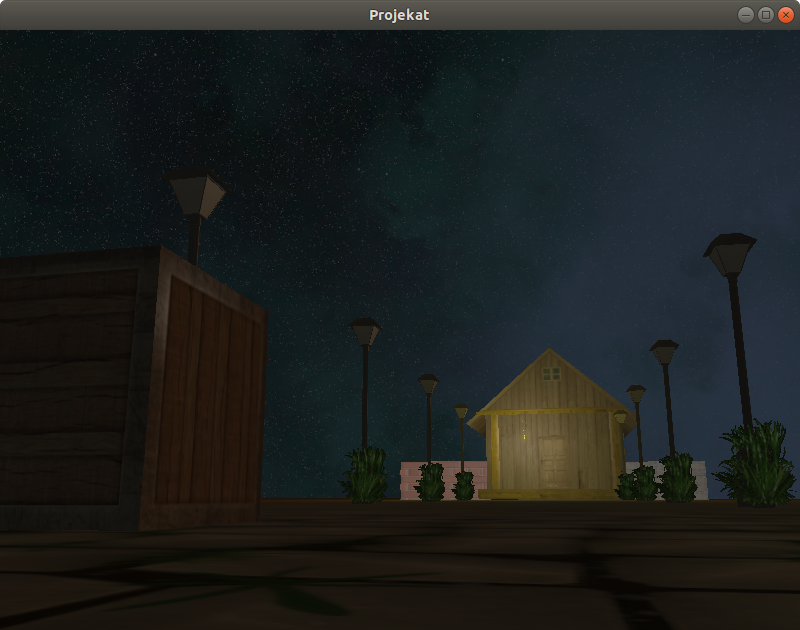
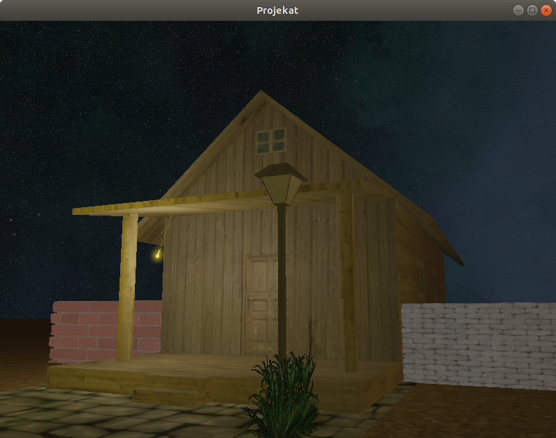

# Projekat iz Računarske grafike

# Komande
1. `F1` - uključivanje/isključivanje kontrole miša
2. `F2` - uključivanje anti aliasing
3. `F3` - isključivanje anti aliasing
4. `W` `A` `S` `D` - kretanje napred, nazad, levo i desno
5. `esc` - zatvaranje prozora
6. `L` - uključivanje/isključivanje spot light-a
7. `K` - uključivanje/isključivanje ulične rasvete
8. `space` - uključivanje/isključivanje hdr-a
9. `X` `C` - smanjivanje/povećavanje exposure
10. `B` - uključivanje/isključivanje bloom-a
11. `Q` `E` - smanjivanje/povećavanje dubine parallax mapping-a

# Implementirane oblasti
Cerović Mina 9/2019: 
A - Cubemaps  
B - HDR, Bloom 
Todorović Todor 241/2019:  
A - Anti Aliasing   
B - Normal mapping, Parallax Mapping
  
#link za snimka projekta
https://youtu.be/pwV1hSt9uD4

     